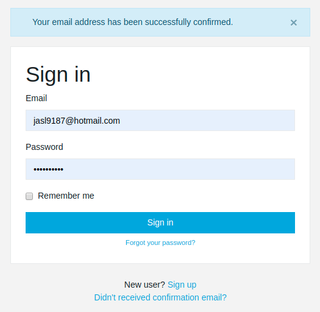
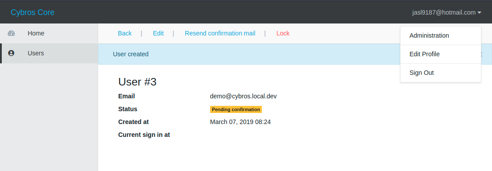

Cybros Core
====

This is a barebone Rails 6.0 app to show some basic configurations.

I'm used to maintain a barebone app that helps me build new project quickly,
and this is extract from my side project initially for sharing my ideas to friends,
but if this valuable to you, use it freely.

## Goal

I hope this could be a template for new app, it should be production-ready,
so I'll keeping polish the codebase, follow best practice, keep dependencies update

I don't wanna add too more features especially business-specific,
but I'd like to perfection User system (based on Devise) because most of apps need this,
and keep improving UI/UX relates works.

I list some help wanted, see below.

## Features

### Classic front-end

Personally, I'm not skilled at front-end and I still prefer to classic Rails server-side rendering,
and partially introduce React or Vue for complex pages.

A good example is Gitlab, I also cheat some useful helpers to this app.

#### Webpacker 4 without Sprockets

Webpacker can do all the jobs that Sprockets,
and has full support of front-end community,
So I remove Sprockets and tune Webpacker allows Assets Pipeline experience.

I do these:

- Remove gems relates to Sprockets
- Search and remove `assets` relates configs
- `resolved_paths: ['app/assets']` in `config/webpacker.yml`
- `app/javascript/packs/application.js` require all static assets (images, webfonts, etc.) 

#### CoreUI with Bootstrap, FontAwesome

See `app/assets/stylesheets/application.scss`

### Application configuration

#### A hack about Rails Credentials

Rails Credentials is a useful feature to store security-sensitive configs.

But we can't bundle `master.key` and  `credentials.yml.enc` isn't readable,
So it's difficult to redistribution the app,
I gave a [PR to Rails](https://github.com/rails/rails/pull/34777) but no respond,
I consist thinking it's useful so I integrate it as a hack, see `bin/rails`.

So you can copy `config/credentials.yml.example` as `config/credentials.yml`,
edit it, then run `rails credentials:encrypt` that will generate `config/credentials.yml.enc` and `config/master.key` for you.

#### A hack about ActionMailer configuration

Unlike `database.yml`, ActionMailer's config separates in many files,
I do a hack that you can config ActionMailer in one place.

See `config/mailer.yml`

Codes in `lib/monkey_patches/action_mailer.rb`

### Implemented a full-feature layouts & views 

I don't have art skill but ... at least it works!

#### Overrides Form Helpers to enhance them support Bootstrap form validation style

The technique is in <https://guides.rubyonrails.org/engines.html#implementing-decorator-pattern-using-class-class-eval>

See `app/overrides/action_view/helpers/form_builder_override.rb`

In addition, see `config/application.rb` how to require overrides.

#### Don't render ActionView's default error field wrapper

That's will break many CSS frameworks.

See `config/initializers/action_view.rb`

### Undocumented yet

TODO:

## Run the app

- Clone it
- `bundle`
- `yarn`
- `cp config/database.yml.example config/database.yml`
- `cp config/credentials.yml.example config/credentials.yml` & `rails credentials:encrypt`
- `cp config/mailer.yml.example config/mailer.yml`
- `rails db:migrate`
- `rails s`

### Receive Devise confirmation mail

In development, I use `mailcatcher` to receive mails,
run `gem install mailcatcher` to installed

Open a new terminal, run `mailcatcher`, then followed the instructions

### Set user as admin

- `cp config/settings.yml config/settings.local.yml`
- Put your email into `admin.emails`
- In user menu (right-top of pages), you should see `Administration`

## Help wanted

- UI/UX design & SCSS & HTML improvement
- Layout for mails
- Coding style & structural improvement
- Try support uploading user avatar using ActiveStorage
- Find bugs
- Docker for deployment, including stages to compiling assets & copy `yml`s, easy to migrate to k8s

## Screenshots

## License

[MIT License](https://opensource.org/licenses/MIT).
